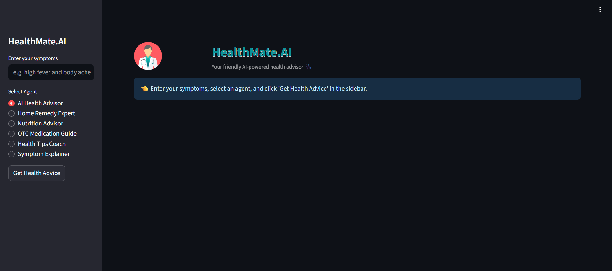

# HealthMate.AI 🩺

An AI-powered health advisor web app that helps users get personalized health 
suggestions based on their symptoms. Built using Python, Streamlit, and CrewAI 
Agents, with secure user login and health history tracking. Deployed live on Render.

---

## 🚀 Features

- 🔐 **User Authentication** – Secure signup & login with password hashing
- 📋 **Symptom Input** – Enter your symptoms & get instant health advice
- 🤖 **6 AI Agents** – Specialized agents for different health needs
- 📜 **Health History** – View & manage your past health consultations
- 🌐 **Live Deployed** – Accessible via public URL on Render
- 💻 **Clean UI** – Simple and responsive interface with Streamlit

---

## 🤖 AI Agents

| Agent | Role |
|-------|------|
| 🩺 AI Health Advisor | First-level health advice based on symptoms |
| 🌿 Home Remedy Expert | Safe, natural home remedies |
| 🥗 Nutrition Advisor | Diet & food suggestions for recovery |
| 💊 OTC Medication Guide | Commonly used over-the-counter medicines |
| 💪 Health Tips Coach | Lifestyle tips for faster recovery |
| 🔍 Symptom Explainer | Explains possible causes behind symptoms |

---

## 🛠️ Tech Stack

- **Python**
- **Streamlit** – Frontend UI
- **CrewAI** – Multi-agent orchestration
  - `LLM` – Language model powering responses
  - `Agent` – Individual expert agents
  - `Task` – Sub-tasks assigned to agents
  - `Crew` – Orchestrates agents & tasks
- **Groq (LLaMA 3.3 70B)** – Fast LLM inference
- **JSON** – Lightweight user data storage
- **hashlib** – Secure password hashing

---

## 🌐 Live Demo

👉 [Try the app here](https://healthmate-ai-1.onrender.com)

---

## 📷 Screenshots

| Home Screen | Results Screen |
|-------------|----------------|
|  |  |

---

## 🔧 Run Locally

**1️⃣ Clone the repository:**
```bash
git clone https://github.com/sneha20056/HealthMate.AI.git
cd HealthMate.AI
```

**2️⃣ Create a `.env` file and add your Groq API key:**
```
GROQ_API_KEY=your_groq_api_key_here
```

**3️⃣ Install dependencies:**
```bash
pip install -r requirements.txt
```

**4️⃣ Run the app:**
```bash
streamlit run app.py
```

---

## 🤝 Contributions

Contributions are welcome! If you'd like to suggest improvements or features, 
feel free to open an issue or pull request.

---

